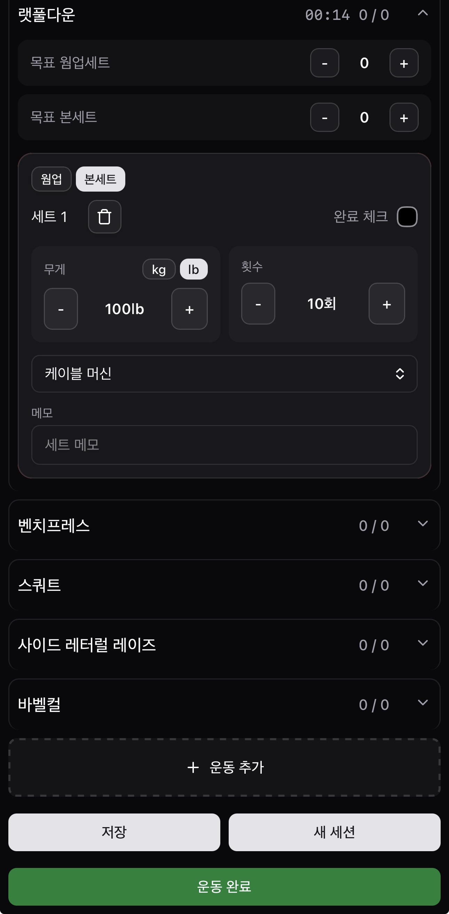

# Daily Set

운동 기록에 집중한 미니멀 웹앱

🔗 **배포:** https://daily.mingile.com/dailyset

## Stack

- Next.js
- React
- TypeScript
- Tailwind CSS
- shadcn/ui
- Notion API
- MongoDB
- Vercel Queue

## 주요 기능

- 세트 단위 기록 — 웜업/본세트 구분, 세트 메모
- 이전 기록 불러오기 — 운동을 추가하면 지난 세션의 세트 구성이 그대로 채워짐
- kg / lb 단위 지원 — 기구별 기본 단위 적용
- 운동별 타이머, 진행 중 세션 자동 임시 저장 — 새로고침·앱 종료 후에도 이어서 기록
- 날짜별 운동 기록 조회
- PWA 설치 · 오프라인에서도 기록 저장
- Notion 연동 — 운동 완료 시 자동 기록, Notion에서 기록 복원

## 기술 선택 이유

**Next.js**

- Notion API는 브라우저에서 직접 호출할 수 없어 서버 쪽 코드가 필요했음
- 별도 서버 없이 API 라우트로 해결하고, Vercel에 설정 없이 무료로 배포하기 위해 선택

**데이터 저장: 로컬 / Notion / MongoDB**

| 저장소       | 담는 것                              | 역할                                      |
| ------------ | ------------------------------------ | ----------------------------------------- |
| localStorage | 운동 기록                            | 기준 저장소(SSOT)                         |
| Notion       | 운동 기록 사본, 운동 목록            | 백업 · 기록 열람 · 운동목록의 기준 저장소 |
| MongoDB      | Notion 연동 정보(토큰, 연결된 DB id) | 서버가 Notion을 호출할 때 사용            |

- 처음엔 Notion을 기준 저장소로 두고 입력 UX만 웹앱으로 만들 계획이었으나, 구현 중 기준을 localStorage로 바꿈
  - Notion을 쓰지 않는 사람도 쓸 수 있게
  - 네트워크가 불안정해도 기록이 저장되게
- 운동 기록은 MongoDB에 저장하지 않음
- 한계: 기록이 브라우저에 묶여 기기 간 공유가 안 되고, Notion 미연동 사용자는 브라우저 데이터를 지우면 기록이 사라짐

**Vercel Queue (Notion 동기화)**

- 세트 수만큼 Notion API 호출이 늘어나 동기 처리 시 사용자가 앱을 켜고 기다려야 했음
- iOS에서 Background Sync API를 지원하지 않아, 운동 완료 시 큐에 넣고 백그라운드에서 Notion에 기록하도록 함
